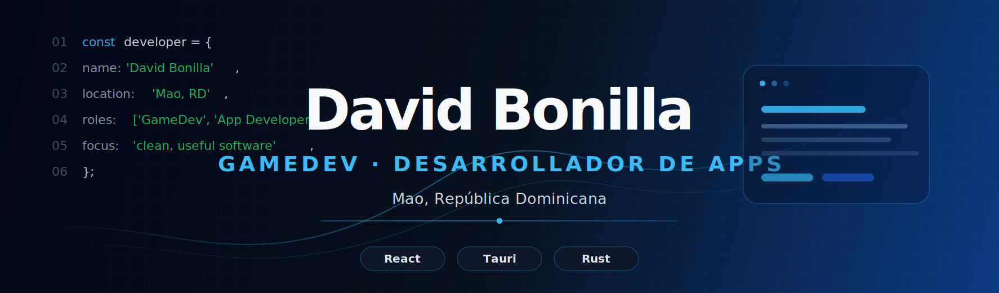

<!-- Perfil GitHub de XsharklinX -->

<p align="center">
  
</p>

<p align="center">
  <a href="mailto:xsharklinx@gmail.com">
    
  </a>
  <a href="https://github.com/XsharklinX?tab=repositories">
    
  </a>
  
</p>

<h3 align="center">Estudiante de Ingeniería en Sistemas · GameDev · Desarrollador de apps</h3>

<p align="center">
  Construyo herramientas de escritorio, productos locales y experiencias interactivas con foco en utilidad, diseño limpio y una base técnica mantenible.
</p>

<p align="center">
  <code>React</code> · <code>TypeScript</code> · <code>Tauri</code> · <code>Rust</code> · <code>Node.js</code> · <code>UI/UX</code>
</p>

---

## Sobre mí

```ts
const david = {
  location: "Mao, República Dominicana",
  role: "Systems Engineering Student",
  focus: ["desktop apps", "local-first tools", "gamedev", "product design"],
  currentStack: ["TypeScript", "React", "Tauri", "Rust", "Node.js"],
  principle: "Build useful software with clean interfaces and maintainable code."
};
```

Me interesa crear software que se sienta directo, rápido y fácil de usar. Trabajo principalmente en proyectos personales donde combino interfaz, lógica de producto, automatización y almacenamiento local.

---

## Proyecto destacado

<table>
  <tr>
    <td width="62%" valign="top">
      <h3>SharkReader</h3>
      <p>
        Lector de libros digitales para <strong>ePub y PDF</strong>, pensado como una app de escritorio moderna: biblioteca local, progreso de lectura, personalización visual y una experiencia cómoda para leer sin fricción.
      </p>
      <p>
        El objetivo es construir una herramienta simple por fuera, pero sólida por dentro: buena organización, interfaz clara, rendimiento estable y una identidad visual propia.
      </p>
      <p>
        <a href="https://github.com/XsharklinX/SharkReader-App"><strong>Repositorio</strong></a>
      </p>
    </td>
    <td width="38%" valign="top">
      <h4>Enfoque técnico</h4>
      <ul>
        <li>App de escritorio con Tauri</li>
        <li>UI moderna con React</li>
        <li>Gestión de biblioteca local</li>
        <li>Experiencia de lectura personalizable</li>
      </ul>
    </td>
  </tr>
</table>

---

## Proyectos principales

<table>
  <tr>
    <td width="50%" valign="top">
      <h3><a href="https://github.com/XsharklinX/Hoard">Hoard</a></h3>
      <p>Vault local para guardar enlaces, imágenes y videos con una experiencia rápida, ordenada y enfocada en productividad personal.</p>
      <p><code>Tauri</code> <code>React</code> <code>Rust</code></p>
    </td>
    <td width="50%" valign="top">
      <h3><a href="https://github.com/XsharklinX/SharkDrive">SharkDrive</a></h3>
      <p>Aplicación de escritorio open-source para convertir Telegram en una nube privada usando una interfaz limpia y flujo local-first.</p>
      <p><code>Tauri</code> <code>Rust</code> <code>React</code></p>
    </td>
  </tr>
  <tr>
    <td width="50%" valign="top">
      <h3><a href="https://github.com/XsharklinX/SharkPDF">SharkPDF</a></h3>
      <p>Herramienta directa para unir archivos PDF de forma gratuita, simple y accesible.</p>
      <p><code>PDF</code> <code>Utilities</code> <code>Desktop</code></p>
    </td>
    <td width="50%" valign="top">
      <h3><a href="https://github.com/XsharklinX/NewsLet">NewsLet</a></h3>
      <p>Proyecto web experimental para organizar y publicar contenido con una estructura sencilla tipo noticias.</p>
      <p><code>Web</code> <code>Frontend</code> <code>Content</code></p>
    </td>
  </tr>
</table>

---

## Stack tecnológico

<p align="center">
  
</p>

<table>
  <tr>
    <td><strong>Frontend</strong></td>
    <td>React · Vite · TypeScript · HTML · CSS · Tailwind · Bootstrap</td>
  </tr>
  <tr>
    <td><strong>Desktop</strong></td>
    <td>Tauri · Rust · WebView-based apps · Local-first architecture</td>
  </tr>
  <tr>
    <td><strong>Backend</strong></td>
    <td>Node.js · APIs · Automatización · Servicios pequeños</td>
  </tr>
  <tr>
    <td><strong>Diseño</strong></td>
    <td>Figma · UI limpia · UX simple · Identidad visual de producto</td>
  </tr>
</table>

---

## Ahora mismo

```diff
+ Mejorando SharkReader como lector de ePub/PDF de escritorio.
+ Diseñando herramientas locales con Tauri, React y Rust.
+ Puliendo interfaces para que los proyectos se sientan más profesionales.
! Prioridad: software útil, visualmente cuidado y fácil de mantener.
```

---

## GitHub

<p align="center">
  
  
</p>

<details>
  <summary><strong>Más métricas</strong></summary>
  <br />
  <p align="center">
    
  </p>
  <p align="center">
    
  </p>
</details>

---

<p align="center">
  
</p>

<p align="center">
  <em>Construyendo software útil, interfaces limpias y proyectos con identidad propia.</em>
</p>
